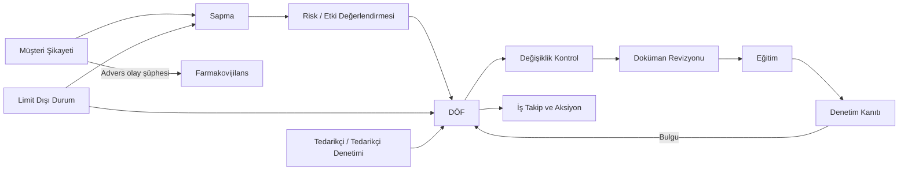
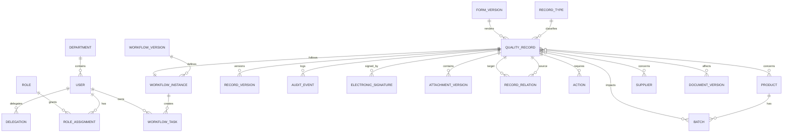

# Tek Kurumlu eQMS Sistem Analizi

**Sürüm:** 1.0  
**Tarih:** 25 Ağustos 2026  
**Kapsam:** QMex eQMS'in kamuya açık ürün sayfası ve interaktif demosu temel alınarak, görseldeki “bağlı zincir” yaklaşımını karşılayacak tek kurumlu bir eQMS projesinin işlevsel ve alansal analizi.  
**Kapsam dışı:** Teknoloji yığını, fiziksel mimari, ayrıntılı API sözleşmeleri, ekran tasarımları ve efor tahmini bu aşamada seçilmemiştir.

> Teknoloji kararı daha sonra verilmiştir. Teknik tasarım için [TEKNIK_MIMARI_VE_PROJE_PLANI.md](./TEKNIK_MIMARI_VE_PROJE_PLANI.md) belgesine bakın.

---

## 1. Belgenin amacı

Bu belge bir ürün broşürü özeti değildir. Amaç, eQMS'in hangi modüllerden oluşacağını, modüllerin hangi ortak motor üzerinde çalışacağını, bir kaydın hangi kapılardan geçeceğini ve modüller arası “tek zincir” izlenebilirliğinin nasıl kurulacağını proje geliştirmeye başlanabilecek ayrıntı düzeyinde tarif etmektir.

Analiz üç kanıt düzeyi kullanır:

- **[Site]** QMex ürün sayfasında açıkça belirtilen davranış.
- **[Demo]** QMex interaktif demosunda ekran veya durum geçişi olarak gözlenen davranış.
- **[Öneri]** Kaynak ürünü birebir kopyalama iddiası taşımayan, bağlı-zincir gereksinimini tamamlamak için önerilen proje davranışı.

Bu ayrım önemlidir: QMex'in pazarlama beyanları bir yazılım gereksinimi veya mevzuata uygunluk kanıtı değildir. Geliştirilecek sistemin uygunluğu; kullanıcı gereksinimleri, risk değerlendirmesi, tasarım, test, validasyon, işletim prosedürleri ve gerçek kullanımın tamamıyla kanıtlanmalıdır.

## 2. Yönetici özeti

İncelenen sistemin asıl ürünü 16 ayrı form uygulaması değil, bu uygulamaların üzerinde çalıştığı **ortak kalite kayıt ve iş akışı motorudur**.

Her modül aynı temel mekanikleri kullanır:

1. Parametrik e-form üzerinden kayıt oluşturulur.
2. Zorunlu alanlar ve iş kuralları sunucuda doğrulanır.
3. Kayıt belirli bir iş akışı tanımının belirli sürümüne bağlanır.
4. Her kritik geçiş yetki kontrolü ve yeniden kimlik doğrulamalı e-imza ister.
5. Görevler kişi, rol, bölüm veya kurul bazında atanır; paralel ya da sıralı ilerleyebilir.
6. Termin, hatırlatma ve eskalasyon motoru görevleri izler.
7. Bir kayıt başka bir modülde çocuk kayıt üretebilir; kaynak-hedef ilişkisi kalıcı tutulur.
8. Açık çocuk kayıt, aksiyon, bulgu, eğitim veya onay varsa üst kayıt kapatılamaz.
9. Her alan değişikliği, durum geçişi, imza ve ilişki denetim izine eklenir.
10. Kapanış bir silme işlemi değil, kanıtı donduran kontrollü bir durum geçişidir.

Bu nedenle önerilen ürün sınırı şöyledir:

> **Tek kurum + ortak kimlik/yetki + sürümlü form motoru + sürümlü iş akışı motoru + e-imza + değiştirilemez denetim izi + ilişki grafiği + 16 alan modülü.**

## 3. Bağlı zincir modeli

Görselde sunulan ana omurga aşağıdaki gibi yorumlanmalıdır:



Zincirin teknik karşılığı doğrusal bir süreç değildir. Aslında yönlü, sürümlü ve denetlenebilir bir **kayıt ilişki grafiğidir**:

- Bir kayıt birden çok kaynaktan üretilebilir.
- Bir kaynak birden çok çocuk kayıt oluşturabilir.
- İlişkinin türü tutulur: `kaynak`, `tetikledi`, `düzeltir`, `etkiler`, `kanıtıdır`, `eğitimini gerektirir`, `yerine geçer`, `aynı olayla ilgilidir`.
- İlişkiyi kimin, ne zaman ve hangi gerekçeyle kurduğu denetim izine girer.
- Bağlantı kaldırılmaz; yanlış ilişki “geçersiz kılındı” durumu ve gerekçesiyle korunur.
- Üst kaydın kapanış motoru, ilişkili kayıtların durumlarını kontrol eder.

### 3.1 Kapanış bağımlılığı

Önerilen genel kural:

```text
Bir kayıt ancak:
  zorunlu incelemeleri tamamlanmışsa
  AND açık görev/aksiyon yoksa
  AND zorunlu çocuk kayıtların kapanış koşulları sağlanmışsa
  AND gerekli etkinlik değerlendirmesi sonuçlanmışsa
  AND son onay rolü e-imza vermişse
kapanabilir.
```

Bağımlılıkların tamamının kapanması her zaman çocuk kaydın `Kapatıldı` olmasını gerektirmeyebilir. Örneğin uzun dönemli bir etkinlik kontrolü ayrı takip kaydı olarak açık kalırken ana kayıt “koşullu kapandı” durumuna geçecekse bu istisna süreç tanımında açık ve denetlenebilir olmalıdır. Varsayılan davranış **fail-closed** olmalıdır: kuralın sonucu belirsizse kapanışa izin verilmez.

## 4. Ortak platform motoru

### 4.1 Ortak kayıt zarfı

Her modül kaydı aşağıdaki ortak alanlara sahip olmalıdır:

- Değişmez dahili kimlik (`UUID/ULID` benzeri).
- İnsan tarafından okunabilir kayıt numarası.
- Modül ve kayıt türü.
- Form şema sürümü.
- İş akışı tanımı ve sürümü.
- Mevcut durum ve alt durum.
- Başlatan kişi, bölüm, pozisyon ve tesis.
- İşlem yetkilisi / mevcut görev sahipleri.
- Oluşturma, olay, tespit, hedef ve kapanış tarihleri.
- Yönetim sistemi kapsamı: GMP, GDP, ISO vb.
- Gizlilik/sınıflandırma seviyesi.
- Ürün, malzeme, batch/seri, ekipman, müşteri, tedarikçi gibi bağlamlar.
- İlişkili kayıtlar.
- Dosyalar ve sürümleri.
- Yorumlar, iadeler ve gerekçeler.
- İmzalar.
- Denetim izi ve alan değişiklikleri.
- Arşiv/saklama politikası.

Kayıt numarası asıl anahtar değildir. Numara formatı kurum parametresi olmalı; örneğin `SP-2026-000042`, `DÖF-2026-000058`. Çakışma oluşmaması için numara sunucuda atomik üretilmelidir.

### 4.2 Sürümlü form motoru

**[Site]** Tüm modüller e-form, durum etiketi, e-imza ve denetim izi kullanan aynı motor üzerinde tarif edilmektedir.

**[Öneri]** Form motoru şunları desteklemelidir:

- Metin, sayı, tarih/saat, seçim, çoklu seçim, kişi, bölüm, ürün, batch, tedarikçi, tablo/satır, zengin metin ve dosya alanları.
- Koşullu görünürlük ve koşullu zorunluluk.
- Alan bazlı okuma/yazma yetkisi.
- Hesaplanan alanlar ve merkezi parametrik sözlükler.
- Tekrarlayan satır grupları; örneğin etkilenen seriler ve aksiyonlar.
- Taslak kaydetme ile iş akışına gönderme arasında ayrı doğrulama seviyeleri.
- Şema yayımlandıktan sonra değişmez sürüm; yeni kayıtlar yeni sürümü, mevcut kayıtlar bağlı oldukları sürümü kullanır.
- Şema değişikliğinin değişiklik kontrol kaydına ve validasyon kanıtına bağlanması.
- Formun insan-okunur PDF çıktısında alan, imza, sürüm ve tarihçe özetinin gösterilmesi.

### 4.3 İş akışı motoru

Motor sadece `durum` alanını değiştirmemeli; her geçiş aşağıdaki sözleşmeyle çalışmalıdır:

```text
TransitionRequest
  record_id
  expected_record_version
  transition_code
  signer_identity
  reauthentication_proof
  meaning_of_signature
  comment / reason
  attachments (gerekirse)

Transaction
  yetki kontrolü
  geçiş önkoşulları (guard)
  zorunlu alan kontrolü
  görev ve bağımlılık kontrolü
  e-imza doğrulaması
  kayıt sürümünü artırma
  imza + audit event + yeni görevleri atomik yazma
  bildirim olayını kuyruğa ekleme
```

Motorun desteklemesi gereken akış türleri:

- Sıralı onay.
- Paralel bölüm değerlendirmesi.
- Tümü onaylamalı (`AND`) kurul.
- Belirli sayıda onay yeterli (`quorum`) kurul.
- Koşula bağlı rota; örneğin “devlet kurumu denetimi” ise Mesul Müdür.
- İade, düzeltme, iptal ve geçersiz kılma.
- İki fazlı kapanış; örneğin devreye alma onayı ve nihai kapanış.
- Alt süreç/çocuk kayıt oluşturma.
- Zamanlayıcı, hatırlatma ve eskalasyon.
- Delegasyon ve kontrollü iş aktarımı.
- İşlem sürümü sabitleme: devam eden kayıt yayımlanmış akış sürümü değişse bile başladığı sürümle tamamlanır veya kontrollü migrasyon yapılır.

### 4.4 E-imza

**[Site/Demo]** Kritik geçişlerde seçim, şifre ve açıklama içeren bir e-imza penceresi gösterilmekte; durum ancak imza sonrasında değişmektedir. İade ve iptalde açıklamanın zorunlu olduğu belirtilmektedir.

**[Öneri]** İmza kaydı en az şunları içermelidir:

- İmzalayanın değişmez kullanıcı kimliği ve imza anındaki görünen adı.
- Tarih/saat, güvenilir sunucu zamanı ve zaman dilimi.
- İmzanın anlamı: oluşturma, gönderme, inceleme, onay, ret, doğrulama, kapanış vb.
- İmzalanan kayıt ve kayıt sürümü.
- İmzadan önce gösterilen kritik veri özeti veya içeriğin kriptografik özeti.
- Kimlik doğrulama yöntemi ve sonucu; parola hiçbir biçimde imza kaydına yazılmaz.
- Gerekçe/açıklama.
- İmza ile kayıt arasındaki koparılamaz bağlantı.

Oturum açmış olmak tek başına imza sayılmamalıdır. Kritik imzada en azından yeniden parola doğrulaması veya kurumun onayladığı güçlü yeniden kimlik doğrulama yöntemi gerekir. Aynı kullanıcının imzası başka kayda kopyalanamaz; imza başka kişiye devredilemez.

### 4.5 Denetim izi

**[Site]** Alan bazında eski değer, yeni değer, işlemi yapan kişi, tarih-saat, not ve imzaların gösterildiği belirtilmektedir.

Denetim izi iki ayrı ama ilişkili düzeyde tutulmalıdır:

1. **İş kaydı denetim izi:** alan değişikliği, durum geçişi, atama, ilişki, dosya sürümü, imza ve çıktı.
2. **Sistem denetim izi:** giriş denemesi, yetki değişikliği, parametre değişikliği, form/akış yayımlama, entegrasyon hatası, yedekleme ve yönetim işlemleri.

Temel kurallar:

- Uygulama kullanıcısına `UPDATE/DELETE` yetkisi vermeyen eklemeli kayıt yapısı.
- Eski değer, yeni değer ve değişiklik nedeni.
- Olay zamanı ile kayıt zamanı ayrı tutulabilir; saat senkronizasyonu izlenir.
- Hassas veriler audit kaydında gereksiz tekrar edilmez; ancak neyin değiştiği anlaşılır kalır.
- Audit kayıtlarının dışa aktarımı, filtrelenmesi ve periyodik inceleme iş akışı bulunur.
- “Audit kaydını görüntüledi” veya “audit incelemesi tamamlandı” eylemleri de kanıtlanabilir.

### 4.6 Görev, termin ve eskalasyon

**[Site]** Termine bir hafta kala ve bir gün kala hatırlatma; gecikmede bölüm yöneticisine eskalasyon örneği verilmektedir.

**[Öneri]** Ortak görev modeli:

- Görev türü, sahibi, vekili, atayanı ve kaynak kaydı.
- Başlangıç, hedef, tamamlanma ve doğrulama tarihleri.
- Öncelik, GxP kritikliği ve SLA politikası.
- Kabul, başlatma, tamamlanma talebi, doğrulama, iade ve iptal durumları.
- Termin değişikliği için ayrı onay ve silinemez termin geçmişi.
- İş günü/tatil takvimine göre hesaplama.
- Bildirim teslim sonucu ve tekrar denemeleri.
- Eskalasyon sadece e-posta değil, uygulama içi görev ve yönetici panosuna da yansır.

### 4.7 İlişkili formlar

Her modül kaydında “İlişkili Formlar” sekmesi ortak olmalıdır. Kullanıcı:

- Mevcut bir kaydı ilişkilendirebilir.
- Yetkisi varsa kaynaktan ön doldurulmuş yeni kayıt oluşturabilir.
- Zinciri yukarı/aşağı yönde görüntüleyebilir.
- İlişkinin kapanışa etkisini görebilir.
- Kaynak olayın hangi CAPA, değişiklik, doküman ve eğitime dönüştüğünü tek ekranda izleyebilir.

## 5. Roller ve yetkilendirme

Sistem tek kurumlu olsa da yalnızca basit rol bazlı yetki yeterli değildir. **RBAC + kayıt bağlamı kuralları** birlikte kullanılmalıdır.

Önerilen temel roller:

- Sistem Yöneticisi.
- Kalite Sistem Yöneticisi / Form-Akış Yöneticisi.
- Kalite Güvence Uzmanı.
- Kalite Güvence Müdürü.
- Mesul Müdür / Qualified Person karşılığı.
- Bölüm Yöneticisi.
- Süreç/Kayıt Sahibi.
- İncelemeci / Onaycı.
- Aksiyon Sorumlusu.
- Denetçi / Baş Denetçi.
- Doküman Yazarı, Kontrolörü ve Onaycısı.
- Eğitim Koordinatörü, Eğitmen, Çalışan ve Yönetici.
- Ruhsat/Regülasyon kullanıcısı.
- Farmakovijilans kullanıcısı / tıbbi değerlendirici.
- Sadece-okuma ve dış denetçi görünümü.
- Kontrollü tedarikçi dış kullanıcısı (gerekiyorsa).

Bağlam kuralları:

- Kullanıcı yalnız kendi bölümü/tesisi kapsamındaki kayıtları görebilir veya işlem yapabilir.
- Kaydı oluşturanın aynı kritik adımı onaylaması görev ayrılığı kuralıyla engellenebilir.
- Mesul Müdür kararı yalnız atanmış role açıktır.
- Gizli şikayet/farmakovijilans verileri özel erişim kapsamına alınır.
- Delegasyon başlangıç-bitiş tarihli, kapsamlı ve denetim izli olmalıdır; imza her zaman fiilen imzalayan kişiye aittir.
- Yetki değişiklikleri geçmiş kayıtların imza ve sahiplik tarihçesini değiştirmez.

## 6. On altı modülün ayrıntılı analizi

### M.01 Sapma Yönetimi

**Amaç:** Planlanan veya onaylı süreçten sapmayı kaydetmek, ürün/seri etkisini belirlemek, kök nedeni ve riski değerlendirmek, gerekli aksiyonları üretmek ve kalite onayıyla kapatmak.

**[Site/Demo] temel veriler:** gerçekleşme ve tespit tarihleri, tespit eden bölüm/aşama, sapma türü, olası sınıflandırma, tanım, beklenen durum, olası kök neden, acil aksiyon, etkilenen batch/seriler, incelemeler, etki ve KG değerlendirmesi, aksiyonlar, etkinlik değerlendirmesi.

**Önerilen akış:**

`Taslak → Gönderildi → Ön İnceleme → Araştırma(lar) → Etki Değerlendirmesi → KG Değerlendirmesi → Aksiyon Uygulama → Etkinlik → Kapanış Onayı → Kapalı`

**Özel kurallar:**

- Olasılık × Şiddet × Tespit Edilebilirlik puanı; sınıf ve hedef tarih parametrelerden otomatik hesaplanır.
- Batch/seri bazında `etkilendi mi`, `kilitlendi mi`, karar ve gerekçe tutulur.
- **Serbest Onayı**, sapmanın nihai kapanışından ayrı bir imzalı karar olmalıdır.
- Kritik/majör sapmada zorunlu kök neden, CAPA ve etkinlik değerlendirmesi tetiklenebilir.
- Benzer sapma aracı ürün, ekipman, kök neden, bölüm ve zaman aralığına göre eşleşme sunmalıdır.

**Bağlantılar:** OOS, Risk/FMEA, DÖF, Değişiklik, Doküman, Eğitim, Batch/Seri ve Denetim.

**Kapanış engelleri:** açık inceleme, açık aksiyon, zorunlu CAPA eksikliği, verilmemiş batch/seri kararı, zorunlu etkinlik değerlendirmesi veya KG kapanış imzası.

### M.02 DÖF Yönetimi

**Amaç:** Bir kaynaktaki kök nedeni ortadan kaldıran düzeltici faaliyeti ve benzer olayın tekrarını önleyen önleyici faaliyeti planlamak, uygulamak ve etkinliğini kanıtlamak.

**[Demo] temel veriler:** yönetim sistemi, DÖF kaynağı, kaynak kayıt, DÖF tanımı, acil aksiyonlar, aksiyon sahibi/hedef tarihi/durumu, etkinlik gerekliliği, sonucu ve tamamlanma tarihi.

**Önerilen akış:**

`Taslak → Kaynak/Kapsam Onayı → Kök Neden Onayı → Aksiyon Planı → Plan Onayı → Uygulama → Gerçekleşen Aksiyon Onayı → Etkinlik Bekleme → Etkinlik Değerlendirmesi → KG Kapanış → Kapalı`

**Özel kurallar:**

- “Aksiyon sorumlusu tamamladı” kapanış değildir; kanıt yüklenir ve KG veya atanmış doğrulayıcı **Gerçekleşen Aksiyon Onayı** verir.
- Etkinlik yöntemi, örneklem, gözlem dönemi, başarı kriteri ve değerlendirici plan onayında sabitlenmelidir.
- Etkisiz sonuç yeni/ek aksiyon veya DÖF revizyonu açmalı, doğrudan kapatılmamalıdır.
- Kaynak bulgu/sapma, DÖF kapanmadan kapanamaz şeklindeki kural süreç tipine göre parametrik olmalıdır.

**Bağlantılar:** tüm olay modülleri, İş Takip, Risk, Değişiklik, Doküman ve Eğitim.

### M.03 Değişiklik Kontrol

**Amaç:** Tesis, süreç, ekipman, yöntem, ürün, doküman, tedarikçi veya sistem değişikliklerini etkileri değerlendirilmiş ve kontrollü biçimde devreye almak.

**Önerilen temel veriler:** değişiklik türü, mevcut/yeni durum, gerekçe, kapsam, geçici/kalıcı, ürün/seri/tesis etkisi, risk, ilgili dokümanlar, validasyon ihtiyacı, ruhsat/varyasyon etkisi, bölüm değerlendirmeleri, uygulama görevleri ve geri dönüş planı.

**Önerilen akış:**

`Taslak → Ön Değerlendirme → Paralel Bölüm/Ruhsat Değerlendirmeleri → Değişiklik Kurulu → Plan Onayı → Uygulama Aksiyonları → Devreye Alma Onayı → Uygulama Sonrası Doğrulama → Nihai Kapanış`

**Özel kurallar:**

- **Devreye Alma Onayı ≠ Kapanış**; iki ayrı imza ve tarih tutulur.
- Ruhsat grubu veya varyasyon etkisi varsa otomatik değerlendirme görevi açılır.
- “Otorite onayı gerekir” sonucu verilmişse onay belgesi olmadan uygulama geçişi engellenir.
- Etkilenen dokümanlar, eğitimler, validasyonlar ve riskler tamamlanmadan devreye alma veya kapanış yapılmaz.
- Başarısız uygulama için kontrollü geri dönüş ve olay/sapma açma yolu olmalıdır.

**Bağlantılar:** Risk, DÖF, Doküman, Eğitim, Artwork, MBR, Tedarikçi ve Sapma.

### M.04 Doküman Yönetimi

**Amaç:** SOP, talimat, spesifikasyon, politika, form ve kayıt şablonlarının taslaktan arşive kadar kontrollü yaşam döngüsünü yönetmek.

**Önerilen akış:**

`Taslak → Yazım → İnceleme(ler) → Onay → Eğitim Bekliyor → Yürürlükte → Revizyon Bekliyor → Yerine Geçti / Geri Çekildi → Arşiv/İmha`

**Temel yetenekler:**

- Doküman türü, kodu, sahibi, bölümü, gizlilik düzeyi, gözden geçirme periyodu.
- Majör/minör revizyon, değişiklik özeti ve karşılaştırma.
- Kontrollü elektronik dağıtım ve okuma kanıtı.
- Yürürlük tarihi ve önceki sürümün otomatik geri çekilmesi.
- Kontrollü basılı kopya: kopya numarası, alan kişi, gerekçe, teslim, geri toplama ve imha.
- Yazdırılamayan/filigranlı görüntüleme ve Secure Print politikası.
- Periyodik gözden geçirme ve gecikme eskalasyonu.

**Kritik kapı:** Pozisyon bazlı zorunlu eğitim tamamlanmadan SOP yürürlüğe giremez; acil yürürlük istisnası varsa ayrı risk kabulü ve imza gerektirir.

### M.05 Eğitim Yönetimi

**Amaç:** Çalışanların pozisyonuna göre gerekli eğitimleri planlamak, atamak, tamamlanma ve yeterlilik kanıtını tutmak.

**Önerilen temel varlıklar:** çalışan eğitim kartı, pozisyon-eğitim matrisi, yıllık plan, eğitim oturumu, doküman okuma görevi, sınav/değerlendirme, kalifikasyon ve yenileme.

**Önerilen akış:**

`Planlandı → Atandı → Çalışıyor/Katılım Bekliyor → Değerlendirme → Yönetici/Eğitmen Onayı → Tamamlandı / Başarısız / Süresi Doldu`

**Özel kurallar:**

- Doküman revizyonu, değişen içeriğin etkilediği pozisyonlara otomatik eğitim ihtiyacı üretir.
- “Okudum ve anladım” e-imzalı olmalı; gerektiğinde sınav veya pratik yeterlilik eklenmelidir.
- Çalışanın kritik işi yapabilmesi aktif kalifikasyonla koşullanabilir.
- İşten ayrılma, bölüm/pozisyon değişikliği ve izin dönemleri eğitim matrisini yeniden hesaplamalıdır.

**Bağlantılar:** Doküman, Değişiklik, DÖF, Sapma ve İnsan/Organizasyon ana verisi.

### M.06 Müşteri Şikayetleri

**Amaç:** Şikayeti ilk alımdan müşteriye nihai cevaba kadar yönetmek; ürün, batch, hasta güvenliği ve tekrar riskini değerlendirmek.

**Önerilen akış:**

`Alındı → Triage → Ön Cevap → Paralel Araştırmalar → Etki/Kök Neden → PV Değerlendirmesi → CAPA Kararı → Nihai Cevap Onayı → Kapalı`

**Temel veriler:** kanal, müşteri/ülke, ürün/seri, olay tarihi, şikayet türü, numune/iade, fotoğraf/dosya, ciddiyet, sağlık etkisi, araştırma bölümleri, cevap terminleri.

**Özel kurallar:**

- Birden çok bölüm araştırması paralel yürüyebilmelidir.
- Ön ve nihai cevap ayrı sürüm ve onay olarak saklanmalıdır.
- Advers olay şüphesi seçildiğinde Farmakovijilans vakası otomatik açılmalı; iki kayıt birbirine bağlanmalıdır.
- Tekrarlayan şikayet, benzerlik ve trend kuralıyla risk/CAPA değerlendirmesi tetiklemelidir.

### M.07 İç Denetimler

**Amaç:** Kurum içi denetim programını planlamak, soru listeleriyle yürütmek, bulguları sınıflandırmak ve kapanışını izlemek.

**Önerilen akış:**

`Yıllık Plan → Denetim Hazırlığı → Plan Onayı → Uygulama → Bulgular → Cevap/Aksiyon → DÖF/Doğrulama → Bulgu Kapanışı → Denetim Kapanışı`

**Kritik kurallar:**

- Denetçi bağımsızlığı ve çıkar çatışması kontrolü.
- Soru listesi sürümü denetim başlangıcında sabitlenir.
- Bulgular etki/risk puanına göre kritik, majör, minör veya gözlem gibi parametrelerle sınıflanır.
- DÖF gerektiren bulgu DÖF kapanmadan; açık bulgu denetim kapanmadan tamamlanmış sayılmaz.
- Plan dışı denetim açılabilir fakat gerekçesi zorunludur.

### M.08 Dış Denetimler

**Amaç:** Otorite ve müşteri denetimlerinin plan, doküman talebi, bulgu, cevap ve kapanış sürecini yönetmek.

**Önerilen akış:**

`Planlandı/Bildirildi → Hazırlık → Denetim → Bulgular → Cevap Planı → DÖF/Aksiyon → Kapanış Mektubu → Yetkili Kapanış → Kapalı`

**Özel kurallar:**

- “Denetleyen devlet kurumu mu?” alanı rotayı etkiler.
- Devlet kurumu ise son kapanış Mesul Müdür/atanmış yetkiliye yönlenir.
- Kapanış mektubu veya otorite kabul kanıtı zorunlu tutulabilir.
- Denetim talep paketi, kontrollü dışa aktarımla ve erişim kaydıyla hazırlanmalıdır.

### M.09 Tedarikçi Denetimi

**Amaç:** Tedarikçi denetimlerini risk bazlı planlamak, yürütmek, bulguları ve tedarikçi cevaplarını izlemek.

**Önerilen akış:**

`Risk Bazlı Plan → Kapsam/Soru Listesi → Denetçi Atama → Uygulama → Bulgular → Tedarikçi Cevabı → Kanıt/Doğrulama → CAPA → Denetim Sonucu`

**Özel kurallar:**

- Plan frekansı tedarikçi kapsamı, kritikliği, geçmiş performansı ve açık bulgulara göre hesaplanabilir.
- Tedarikçi geri dönüşü sınırlı dış kullanıcı ekranı veya güvenli tek kullanımlık davet üzerinden alınabilir; bu yapı ikinci bir tenant değildir.
- Kritik bulgu tedarikçi durumunu otomatik askıya alabilir veya yeniden onay gerektirebilir.

### M.10 İş Takip ve Aksiyon

**Amaç:** Diğer modüllerden gelen ya da bağımsız oluşturulan işlerin sahibi, hedefi, kanıtı ve doğrulamasını ortak biçimde izlemek.

**Önerilen akış:**

`Atandı → Kabul Edildi → Devam Ediyor → Tamamlanma Talebi → Doğrulama → Doğrulandı / İade / İptal`

**Özel kurallar:**

- Düzeltici, önleyici, iyileştirici, acil, eğitim, doküman, validasyon vb. aksiyon türleri parametrik olmalıdır.
- Tamamlanma kanıtı ve gerçekleşen aksiyon açıklaması zorunlu hale getirilebilir.
- Hedef tarih değişikliği ayrı onay, gerekçe ve termin geçmişi üretir.
- Kaynak kayıt kapanış kontrolü bu modülün doğrulanmış durumunu sorgular.

### M.11 Risk Yönetimi (FMEA)

**Amaç:** Süreç/ürün/sistem risklerini başlangıç ve kalan risk seviyeleriyle yönetmek; azaltma faaliyetlerini izlemek.

**Önerilen akış:**

`Taslak → Kapsam Onayı → İlk Skorlama → Risk Kararı → Azaltma Aksiyonları → Kalan Risk Skoru → Risk Kabulü → Periyodik Gözden Geçirme`

**Temel model:** tehlike/hata türü, neden, etki, mevcut kontroller, olasılık, şiddet, tespit edilebilirlik, RPN/EÖN, risk sınıfı, azaltma, kalan risk, kabul eden.

**Kurallar:**

- `RPN = Olasılık × Şiddet × Tespit Edilebilirlik` sunucuda hesaplanır.
- Skala ve eşikler sürümlü parametre olmalıdır; eski risklerin tarihsel sonucu değişmemelidir.
- Yüksek riskte zorunlu aksiyon ve hedef tarih oluşturulur.
- Kalan risk ilk riskten yüksekse ek gerekçe/onay veya blokaj uygulanır.
- Risk revizyonları birbirinin yerine yazılmaz; her revizyon karşılaştırılabilir kalır.

### M.12 MBR Yönetimi

**Amaç:** Yayımlanmış Master Batch Record dokümanlarının kontrollü baskı ve kopya yaşam döngüsünü yönetmek.

**Önerilen akış:**

`Yürürlükte MBR Seçimi → Baskı Talebi/Gerekçe → Yetki Kontrolü → Kontrollü Baskı → Teslim → Kullanım → Geri Çekme → İmha/Arşiv`

**Özel kurallar:**

- Yalnız yürürlükteki ve onaylı sürüm basılabilir.
- Her kopyanın benzersiz kopya numarası, baskı zamanı, basan/teslim alan, hedef batch ve durumu bulunur.
- Tekrar baskı önceki baskıyı görünür kılar ve gerekçe/onay ister.
- Süresi dolan baskı tokenı kullanılamaz.
- Geri çekilen kopya “İmha Edildi” kanıtı olmadan kapanmaz.

### M.13 Artwork Yönetimi

**Amaç:** Ambalaj ve basılı materyal tasarımlarının bölüm incelemeleri, çok seviyeli onayları ve revizyonlarını yönetmek.

**Önerilen akış:**

`Tasarım Taslağı → Teknik/Regülasyon/Medikal/Üretim İncelemeleri → Düzeltme Turları → Nihai Onay → Yayımlandı → Yerine Geçti`

**Özel kurallar:**

- Paralel veya sıralı inceleme rotası ürün/pazar türüne göre seçilebilir.
- Dosya sürümleri değiştirilemez; yeni yükleme yeni sürümdür.
- Grafik PDF karşılaştırma görsel fark, metin farkı ve sayfa farkı üretmelidir.
- Ruhsat onayı, barkod, dil/pazar ve yürürlük tarihi kontrolleri parametrik olmalıdır.
- Değişiklik kaydı ve ilgili doküman/MBR sürümleriyle ilişkilendirilmelidir.

### M.14 Limit Dışı Durum (OOS/OOT)

**Amaç:** Spesifikasyon veya trend dışı laboratuvar/üretim sonuçlarını fazlı soruşturma ve kök neden analiziyle yönetmek.

**Önerilen akış:**

`İlk Kayıt → Numune/Sonuç Kilidi → Faz I Laboratuvar İncelemesi → Geçersiz/Gerçek OOS Kararı → Faz II Tam Soruşturma → Batch Etkisi → Kök Neden/CAPA → KG Onayı → Kapanış`

**Özel kurallar:**

- Orijinal sonuç silinemez veya yeni sonuçla üzerine yazılamaz.
- Tekrar test/yeniden numune alma önceden tanımlı bilimsel gerekçe ve onay ister.
- Faz geçişleri OOS türüne göre parametrik olabilir.
- Gerçek OOS ürün/seri serbest bırakma kararını, Sapma ve DÖF süreçlerini tetikleyebilir.
- Tüm ham veri ve cihaz/analist/yöntem bağlamı korunmalıdır.

### M.15 Farmakovijilans

**Amaç:** Advers reaksiyon ve güvenlilik vakalarını kodlamak, değerlendirmek, raporlamak ve takip etmek.

**Önerilen akış:**

`Vaka Alımı → Asgari Kriter Kontrolü → Mükerrer Kontrolü → Ciddiyet/Beklenirlik/Nedensellik → Medikal İnceleme → MedDRA Kodlama → XML/Raporlama → Takip → Kapanış`

**Temel alanlar:** hasta/olay bilgisi, bildirici, ürün, doz, tarih, sonuç, ciddiyet kriteri, beklenirlik, nedensellik, MedDRA terimleri, raporlama ülkesi/otoritesi ve zaman sınırı.

**Özel kurallar:**

- Şikayet kaydında advers olay şüphesi varsa vaka otomatik başlatılır.
- Kişisel ve sağlık verileri genel kalite kayıtlarından daha kısıtlı erişim ve maskeleme gerektirir.
- Mükerrer vaka birleştirme silme değildir; ana vaka ve ilişki korunur.
- XML şeması ve gönderim profilleri sürümlü olmalıdır; gönderim yanıtı ve takip raporları saklanır.

### M.16 Tedarikçi Değerlendirme

**Amaç:** Tedarikçileri kapsam bazlı kriterler, bölüm puanları, risk ve dönemsel performansla nitelendirmek.

**Önerilen akış:**

`Başvuru/Kapsam → Doküman Toplama → Bölüm Değerlendirmeleri → Risk/Puan → KG Onayı → Onaylı / Koşullu / Reddedildi / Askıda → Periyodik Değerlendirme → Yeniden Nitelendirme`

**Özel kurallar:**

- Aynı tedarikçi farklı kapsamlar için farklı statüye sahip olabilir.
- Kriter ve ağırlık sürümü değerlendirmeyle birlikte saklanır.
- Kritik şikayet, sapma, OOS veya tedarikçi denetim bulgusu ara değerlendirme tetikler.
- Skor tek başına karar değildir; istisnai karar gerekçe ve yetkili onayı ister.

## 7. Uçtan uca örnek zincirler

### 7.1 Sapma → DÖF → Değişiklik → Doküman → Eğitim

1. Üretimde sapma açılır; batch kilitlenir ve acil aksiyon kaydedilir.
2. Risk skoru sapmayı majör sınıfa getirir; hedef kapanış tarihi hesaplanır.
3. Araştırma kök nedeni doğrular; DÖF oluşturulur.
4. DÖF aksiyonu proses parametresi değişikliği gerektirir; Değişiklik Kontrol açılır.
5. Değişiklik etkilediği SOP ve MBR revizyonlarını üretir.
6. SOP onaylanır, ilgili pozisyonlara eğitim görevi oluşur.
7. Eğitimler tamamlanınca SOP yürürlüğe ve değişiklik devreye alma onayına gider.
8. DÖF gerçekleşen aksiyon onayı alır; izleme döneminden sonra etkinlik doğrulanır.
9. DÖF kapanır; sapmanın açık bağımlılığı çözülür ve KG sapmayı kapatır.

### 7.2 Denetim → Bulgu → DÖF → Denetim kapanışı

1. Denetim plan ve soru listesi sürümüyle başlatılır.
2. Bulgu açılır ve risk/etki puanına göre sınıflanır.
3. “DÖF gerekli” kararı tek işlemle ilişkili DÖF açar.
4. Aksiyon planı, gerçekleşen aksiyon ve etkinlik doğrulaması tamamlanır.
5. DÖF kapandıktan sonra bulgu kapanabilir.
6. Tüm bulgular kapanmadan denetim kapanış geçişi engellenir.

### 7.3 Şikayet → Farmakovijilans → DÖF

1. Şikayet triage sırasında hasta güvenliği/advers olay işareti alır.
2. Sistem PV vakasını oluşturur ve şikayet verilerinin izinli alt kümesini aktarır.
3. PV gizlilik sınırları nedeniyle sağlık verisi şikayet ekranında gereksiz gösterilmez.
4. Ürün kalite kusuru araştırması şikayet modülünde; tıbbi değerlendirme PV modülünde paralel ilerler.
5. Ortak kök neden veya tekrar riski DÖF üretir.
6. Nihai müşteri cevabı ve PV raporlama yükümlülükleri tamamlanmadan şikayet kapatılamaz.

### 7.4 OOS → Sapma → Batch kararı

1. Laboratuvar sonucu OOS kaydı açar; orijinal sonuç değişmez biçimde saklanır.
2. Faz I sonucu gerçek OOS gösterirse Sapma oluşturulur.
3. Sapma batch/seri kaydını kilitler; Mesul Müdür/KG serbest bırakma kararını ayrı imzalar.
4. Faz II kök neden ve CAPA tamamlanır.
5. Batch kararı ile OOS/sapma nihai kapanışı ayrı tutulur.

### 7.5 Tedarikçi performansı → Denetim → Askıya alma

1. Periyodik değerlendirme skoru eşik altına düşer.
2. Risk motoru tedarikçi denetimi ve geçici koşullu statü oluşturur.
3. Kritik bulgu CAPA ve gerekirse satın alma kullanımı askıya alma kararı üretir.
4. Kanıt ve etkinlik doğrulanınca kapsam bazlı tedarikçi statüsü yeniden onaylanır.

## 8. Kavramsal veri modeli



### 8.1 Çekirdek tablolar/varlıklar

**Kimlik ve organizasyon**

- `User`, `Department`, `Position`, `Site`, `Role`, `Permission`, `RoleAssignment`.
- `Delegation`, `Substitution`, `UserQualification`.
- `OrganizationSettings` tekil kurum ayarları.

**Form ve akış tanımları**

- `FormDefinition`, `FormVersion`, `FieldDefinition`, `LookupDefinition/Version`.
- `WorkflowDefinition`, `WorkflowVersion`, `StateDefinition`, `TransitionDefinition`, `GuardRule`, `AssignmentRule`, `EscalationPolicy`.

**Çalışan kayıtlar**

- `QualityRecord`, `RecordVersion`, `RecordData` veya modüle özgü tablolar.
- `WorkflowInstance`, `WorkflowTask`, `TransitionExecution`.
- `Action`, `DueDateChange`, `Notification`, `EscalationEvent`.
- `ElectronicSignature`, `AuditEvent`, `FieldChange`.
- `Attachment`, `AttachmentVersion`, `Comment`, `RecordRelation`.

**Ana veriler**

- `Product`, `Material`, `Batch`, `Equipment`, `Customer`, `Supplier`, `ManagementSystem`, `Country`, `Calendar`.

**Modül varlıkları**

- Sapma: `Deviation`, `DeviationInvestigation`, `BatchImpact`, `ReleaseDecision`.
- DÖF: `Capa`, `CapaAction`, `ActionVerification`, `EffectivenessPlan/Result`.
- Değişiklik: `ChangeControl`, `ImpactAssessment`, `RegulatoryAssessment`, `CommissioningDecision`.
- Doküman: `Document`, `DocumentVersion`, `ControlledCopy`, `Distribution`.
- Eğitim: `TrainingRequirement`, `TrainingAssignment`, `TrainingEvent`, `Assessment`, `Qualification`.
- Denetim: `AuditPlan`, `Audit`, `ChecklistVersion`, `Finding`, `FindingResponse`.
- Risk: `RiskAssessment`, `RiskItem`, `RiskScore`, `RiskMitigation`.
- Diğer modüller benzer şekilde çekirdek kayda birincil anahtarla bağlanır.

### 8.2 JSON form verisi mi, ilişkisel alan tabloları mı?

Teknoloji yığınından bağımsız tasarım önerisi:

- Ortak ve kritik sorgu alanları ilişkisel kolonlarda tutulmalıdır: durum, tarihler, sahiplik, ürün, batch, sınıf, risk.
- Değişken form alanları sürümlü JSON belge olarak tutulabilir.
- Raporlanacak değişken alanlar için indekslenmiş projeksiyon veya arama indeksi oluşturulabilir.
- Denetim izi tüm JSON'u körlemesine kopyalamak yerine alan yolu bazında eski/yeni değer üretmelidir.
- Modüle özgü karmaşık ve kurallı alt varlıklar (aksiyon, seri etkisi, risk satırı, kontrollü kopya) ayrı tablolarda olmalıdır.

## 9. Kritik iş kuralları kataloğu

1. Kayıt numarası istemciden kabul edilmez; sunucuda üretilir.
2. Her güncelleme beklenen sürümle yapılır; eşzamanlı değişiklikte kullanıcıya çakışma gösterilir.
3. Yayımlanmış form/akış/parametre sürümü geriye dönük değiştirilmez.
4. Kritik geçişler e-imza olmadan gerçekleşmez.
5. İade, ret, iptal, geçersiz kılma ve termin değişiminde gerekçe zorunludur.
6. Kullanıcı kendi görevini yalnız aktif yetkisi ve kapsamı varsa işleyebilir.
7. Delegasyon imzanın sahibini değiştirmez; vekil kendi kimliğiyle imzalar.
8. Açık zorunlu görev, aksiyon, bulgu veya çocuk kayıt varken kapanış engellenir.
9. Çocuk kayıt oluşturma ve ilişki yazımı tek transaction içinde yapılır veya idempotent olay işleyicisiyle güvenceye alınır.
10. Aynı tetikleyici tekrar işlenirse mükerrer DÖF/PV/eğitim açılmaz.
11. Dosya güncellemesi yeni sürüm oluşturur; önceki dosya erişilebilir kalır.
12. Kapanmış kayıt düzenlenmez; düzeltme gerekiyorsa kontrollü yeniden açma veya ek kayıt süreci kullanılır.
13. Fiziksel silme normal kullanıcı işlevi değildir; saklama süresi sonu imhası ayrı yetki, politika ve kanıt ister.
14. Risk ve hedef tarih hesapları istemcide gösterilse bile sunucuda yeniden hesaplanır.
15. Rapor ve dışa aktarımlar kullanıcının satır/alan yetkilerini aşamaz.
16. Saat, tarih ve iş günü hesapları kurum saat dilimi ve sürümlü tatil takvimine bağlıdır.

## 10. Arama, raporlama ve panolar

**Ortak iş listesi**

- Bekleyen işlerim, vekaleten işler, bölümümün geciken işleri.
- Termin yaklaşan, gecikmiş, iade edilmiş, imza bekleyen görevler.
- Modül, durum, sınıf, ürün, batch, tedarikçi, bölüm ve tarih filtreleri.

**Operasyonel panolar**

- Açık kayıt ve yaşlandırma dağılımı.
- Ortalama/medyan kapanış süresi.
- Termin uyumu ve eskalasyon sayısı.
- Kök neden, ürün, süreç ve bölüm trendleri.
- Tekrarlayan sapma/şikayet/OOS.
- CAPA etkinlik başarı oranı.
- Eğitim uyum yüzdesi ve kalifikasyon açıkları.
- Denetim planı gerçekleşme ve bulgu dağılımı.
- Tedarikçi risk ve performans trendi.

**Dışa aktarım**

- İnsan-okunur imzalı kayıt özeti.
- Denetim paketi: kayıt, ilişkiler, dosya listesi, imzalar ve denetim izi.
- Excel/PDF çıktıları; çıktı zamanı, kullanıcı ve filtre kriterleri audit olayına yazılabilir.
- Büyük veri dışa aktarımı asenkron ve yetki kontrollü olmalıdır.

## 11. Uyum ve veri bütünlüğü gereksinimleri

### 11.1 21 CFR Part 11 eşleştirmesi

Resmî eCFR metni, kapalı sistemlerde validasyon, doğru/tam kopya, saklama, yetkili erişim, zaman damgalı denetim izi, işlem sırası ve yetki kontrollerini şart koşar. İmzalı kayıtta imzalayan adı, tarih-saat ve imzanın anlamı görünmeli; imza kayda kalıcı bağlanmalıdır.

| Düzenleme alanı | Proje kontrolü |
|---|---|
| Sistem validasyonu | URS → risk → tasarım → test → izlenebilirlik matrisi → yayın/onay |
| Doğru ve tam kopya | İnsan-okunur PDF + makine-okunur dışa aktarım + bütünlük doğrulama |
| Kayıt koruma/saklama | Sürümlü kayıt, saklama politikası, arşiv ve geri çağırma testi |
| Yetkili erişim | RBAC + kapsam + görev ayrılığı + erişim yaşam döngüsü |
| Zaman damgalı audit trail | Eklemeli audit event, eski/yeni değer, neden, kullanıcı, zaman |
| İşlem sırası kontrolü | Workflow guard ve sunucu taraflı durum makinesi |
| İmza görünümü | Ad, tarih-saat, anlam ve kayıt sürümü |
| İmza-kayıt bağı | Değişmez yabancı anahtar + içerik/sürüm özeti |
| Kimlik/parola kontrolleri | Benzersiz kullanıcı, parola politikası, kilitleme, yeniden doğrulama, ihlal alarmı |

### 11.2 EU GMP Annex 11 eşleştirmesi

Annex 11; risk yönetiminin sistem yaşam döngüsü boyunca uygulanmasını, uygulama validasyonunu ve altyapı kalifikasyonunu, güncel sistem tanımını, izlenebilir kullanıcı gereksinimlerini, veri aktarım kontrollerini, yedek/geri dönüş testlerini, audit trail incelemesini, kontrollü konfigürasyon değişikliklerini, periyodik değerlendirmeyi, güvenliği, olay yönetimini, e-imzayı, iş sürekliliğini ve arşiv erişilebilirliğini kapsar.

Projede yalnız çalışma zamanı özellikleri değil, şu operasyonel süreçler de tasarlanmalıdır:

- Bilgisayarlı sistem envanteri ve kritik sistem açıklaması.
- URS, fonksiyonel risk değerlendirmesi ve gereksinim-test izlenebilirliği.
- Form, akış, parametre ve uygulama değişiklik kontrolü.
- Test ortamı ve üretim ayrılığı; kontrollü sürüm alma.
- Veri migrasyonu mutabakatı.
- Yedekleme, geri yükleme ve felaket kurtarma testleri.
- Periyodik sistem değerlendirmesi.
- Audit trail periyodik inceleme planı ve kanıtı.
- Güvenlik olayı, sapma ve CAPA yönetimi.
- İş sürekliliği ve gerektiğinde kontrollü manuel prosedür.
- Sistem emekliliği ve uzun dönem arşiv okuma testi.

### 11.3 ALCOA+ tasarım hedefi

Her kayıt:

- **Attributable:** Kimin yaptığı bellidir.
- **Legible:** İnsan tarafından okunabilir ve dışa aktarılabilir.
- **Contemporaneous:** Olay ve kayıt zamanları izlenir.
- **Original:** Orijinal kayıt ve sürümler korunur.
- **Accurate:** Doğrulama, ikinci kontrol ve hesap kuralları vardır.
- **Complete:** Başarısız, iptal, iade ve eski sürümler dahil geçmiş tamdır.
- **Consistent:** Zaman ve sıra tutarlıdır.
- **Enduring:** Saklama süresi boyunca kalıcıdır.
- **Available:** Denetim ve iş ihtiyacında erişilebilirdir.

## 12. Tek kurumlu mimari sınırları

Bu proje **multi-tenant olmayacaktır**. Bunun işlevsel sonucu:

- Tek bir `OrganizationSettings` kaydı ve tek kurum markası/parametre seti vardır.
- İş kayıtlarına `tenant_id` eklenmez; tüm kayıtlar aynı kuruma aittir.
- Tek kurum içinde birden fazla tesis, bölüm, yönetim sistemi ve ülke desteği yine bulunabilir.
- Veri görünürlüğü tenant izolasyonuyla değil, tesis/bölüm/rol/gizlilik kurallarıyla sağlanır.
- Kayıt numara şablonları kurum genelinde veya tesis-modül-yıl bazında parametrelenebilir.
- Dış tedarikçi veya denetçi erişimi ikinci tenant oluşturmaz; sınırlı kapsamlı dış kimliktir.
- Geliştirme, test/validasyon ve üretim ortamları kesinlikle ayrıdır; tek tenant olmak tek ortam demek değildir.
- Yedekleme, arşiv ve felaket kurtarma verileri de kurum bazında tek bütün olarak yönetilir.

Önerilen sınır, ileride çok kiracılı SaaS'a dönüşmeyi optimize etmek değil; tek kurumun denetlenebilir, anlaşılır ve valide edilebilir sistemini sade tutmaktır. Buna rağmen kod içinde kurum adı gibi değerler sabit yazılmamalı, tekil ayarlardan okunmalıdır.

## 13. Güvenlik ve işletim gereksinimleri

- Kurumsal kimlik sağlayıcı veya yerel kimlik yönetimi; teknoloji seçiminde kararlaştırılacak.
- MFA ve kritik e-imza yeniden doğrulaması.
- En az ayrıcalık, görev ayrılığı ve periyodik erişim gözden geçirmesi.
- Hesap açma, rol değiştirme, askıya alma ve kapatma iş akışı.
- Brute-force koruması, parola/token yaşam döngüsü ve güvenlik uyarıları.
- Uçtan uca TLS; aktarımda ve depoda şifreleme.
- Dosya zararlı yazılım taraması ve güvenli önizleme.
- Gizli alan maskeleme ve kontrollü dışa aktarım.
- Merkezi, güvenilir saat senkronizasyonu.
- Uygulama, iş kuyruğu, e-posta ve entegrasyon sağlığı izleme.
- Yedekleme başarısı değil, periyodik geri yükleme testi başarı kriteridir.
- RPO/RTO ve saklama süreleri risk değerlendirmesiyle belirlenmelidir.
- Üretim verisi test ortamına doğrudan kopyalanmamalı; maskeleme/anonimleştirme uygulanmalıdır.

## 14. İşlevsel olmayan gereksinimler

Teknoloji seçilmeden önce hedef değerleri iş birimiyle netleştirilecek başlıklar:

- Eşzamanlı kullanıcı ve toplam kullanıcı sayısı.
- Yıllık kayıt, audit event ve dosya hacmi.
- Dosya boyutu ve saklama süresi.
- Arama ve ana ekran yanıt süreleri.
- Kritik ekranların kullanılabilirlik hedefi.
- RPO, RTO ve iş sürekliliği hedefleri.
- Türkçe/İngilizce ve tarih/saat yerelleştirmesi.
- Erişilebilirlik seviyesi.
- On-premise, özel bulut veya genel bulut kısıtları.
- E-posta, SSO, ERP/MES/LIMS/HR ve ürün-batch ana veri entegrasyonları.
- Elektronik raporlama ve MedDRA lisans/kodlama gereksinimleri.

## 15. Önerilen ürünleştirme sırası

### Faz 0 — Validasyon ve alan temeli

- Süreç sahipleri ve düzenleyici kapsam.
- URS, veri sınıflandırması, risk değerlendirmesi.
- Organizasyon, kimlik, rol, bölüm ve ana veriler.
- Form/akış sürümleme, e-imza, audit trail, dosya, bildirim ve ilişkili kayıt çekirdeği.

### Faz 1 — Bağlı zincir MVP

- Sapma Yönetimi.
- DÖF Yönetimi.
- İş Takip ve Aksiyon.
- Risk/FMEA.
- İç Denetimler.
- Ortak panolar ve denetim paketi.

Bu faz, görseldeki zincirin ana mekaniklerini kanıtlar: kaynaktan DÖF, açık aksiyonla kapanış engeli, gerçekleşen aksiyon doğrulaması, etkinlik ve denetim izi.

### Faz 2 — Değişiklik, doküman ve eğitim halkası

- Değişiklik Kontrol.
- Doküman Yönetimi.
- Eğitim Yönetimi.
- MBR ve Artwork.

Bu faz, “değişiklik → doküman → eğitim → devreye alma/kapanış” bağımlılığını tamamlar.

### Faz 3 — Olay ve dış taraf süreçleri

- Müşteri Şikayetleri.
- Limit Dışı Durum.
- Farmakovijilans.
- Dış Denetimler.
- Tedarikçi Denetimi ve Tedarikçi Değerlendirme.

### Faz 4 — Entegrasyon, gelişmiş analitik ve validasyon sertleştirmesi

- HR/SSO, ERP/MES/LIMS ve e-posta entegrasyonları.
- Benzer kayıt/trend analizi.
- Gelişmiş yönetim panoları.
- Performans, güvenlik, felaket kurtarma ve kullanıcı kabul testleri.
- Üretim geçişi ve validasyon paketi.

## 16. MVP kabul senaryoları

1. Kullanıcı zorunlu alanları boş sapmayı iş akışına gönderemez.
2. Yetkisiz kullanıcı başka bölümün kritik geçişini imzalayamaz.
3. E-imza doğrulanmadan durum değişmez ve görev oluşmaz.
4. Aynı kayıt iki kullanıcı tarafından eşzamanlı düzenlenirse sessiz veri kaybı olmaz.
5. Sapmadan bir DÖF oluşturulduğunda iki yönlü ilişki görünür ve işlem tekrarı mükerrer kayıt üretmez.
6. Açık DÖF aksiyonu varken kaynak bulgu/sapma kapanamaz.
7. Aksiyon sorumlusu tamamladıktan sonra KG doğrulaması olmadan aksiyon kapalı sayılmaz.
8. Etkisiz CAPA değerlendirmesi yeni aksiyon/revizyon gerektirir.
9. Her alan değişikliği eski/yeni değer, kullanıcı, zaman ve gerekçeyle görüntülenir.
10. İmza görünümünde kişi, zaman, anlam ve ilgili kayıt sürümü vardır.
11. Termin değişikliği önceki tarihi yok etmez.
12. Doküman yeni sürümü onaylansa bile zorunlu eğitimler bitmeden yürürlüğe giremez.
13. Devreye alma onayı verilen değişiklik nihai kapanış olmadan ayrı durumda kalır.
14. Devlet kurumu dış denetimi Mesul Müdür kapanışına yönlenir.
15. Kontrollü MBR tekrar baskısı gerekçe ve önceki kopya farkındalığı olmadan yapılamaz.
16. Bir kayıt; PDF, imzalar, ilişkiler ve audit trail ile denetim paketi olarak dışa aktarılabilir.
17. Yedekten geri dönen sistemde kayıt, imza ve ilişki bütünlüğü doğrulanabilir.

## 17. Açık iş kararları

Teknoloji yığınından önce veya onunla birlikte aşağıdaki iş kararları verilmelidir:

1. İlk üretim kapsamı ilaç GMP mi, genel QMS mi, yoksa ikisi mi?
2. İlk fazda hangi modüller zorunlu?
3. Kurum içindeki tesis, bölüm ve yaklaşık kullanıcı sayısı nedir?
4. Bulut mu kurum içi kurulum mu isteniyor?
5. SSO/Active Directory, e-posta, HR, ERP, LIMS veya MES entegrasyonları var mı?
6. Elektronik imzada sadece yeniden parola mı, MFA/kurumsal kimlik doğrulaması mı kullanılacak?
7. Türkçe tek dil mi, Türkçe/İngilizce çift dil mi?
8. Farmakovijilans ve MedDRA/XML kapsamı ilk sürümde gerçekten gerekli mi?
9. Saklama süreleri, RPO/RTO ve dosya hacmi beklentileri nedir?
10. Form ve akışlar kodla mı, yönetici ekranından parametrik mi tasarlanacak?

## 18. Kaynaklar

### İncelenen ürün kaynakları

- [QMex eQMS ürün ve modül sayfası](https://qmex.com.tr/eqms.html#moduller)
- [QMex eQMS interaktif demo](https://qmex.com.tr/demo-qmex.html)

### Resmî düzenleyici ve iyi uygulama kaynakları

- [eCFR — 21 CFR Part 11, Electronic Records; Electronic Signatures](https://www.ecfr.gov/current/title-21/chapter-I/subchapter-A/part-11)
- [European Commission — EudraLex Volume 4](https://health.ec.europa.eu/medicinal-products/eudralex/eudralex-volume-4_en)
- [European Commission — EU GMP Annex 11: Computerised Systems (PDF)](https://health.ec.europa.eu/document/download/8d305550-dd22-4dad-8463-2ddb4a1345f1_en?filename=annex11_01-2011_en.pdf)
- [FDA — Data Integrity and Compliance With Drug CGMP: Questions and Answers](https://www.fda.gov/regulatory-information/search-fda-guidance-documents/data-integrity-and-compliance-drug-cgmp-questions-and-answers)
- [ISPE — GAMP 5 Guide, Second Edition overview](https://ispe.org/publications/guidance-documents/gamp-5-guide-2nd-edition)

---

## Sonuç

Geliştirilecek sistemin merkezinde “16 menü” değil, **kanıt üreten ortak kayıt motoru** yer almalıdır. Başarının ölçütü bir formun dijital olması değil; olayın kaynağından riskine, aksiyonuna, değişikliğine, dokümanına, eğitimine ve denetim kanıtına kadar bağlantının kopmaması ve hiçbir kritik kararın yetkisiz, imzasız veya tarihçesiz ilerleyememesidir.
