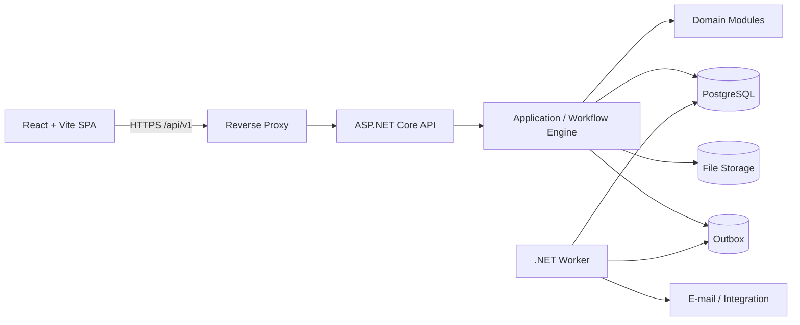
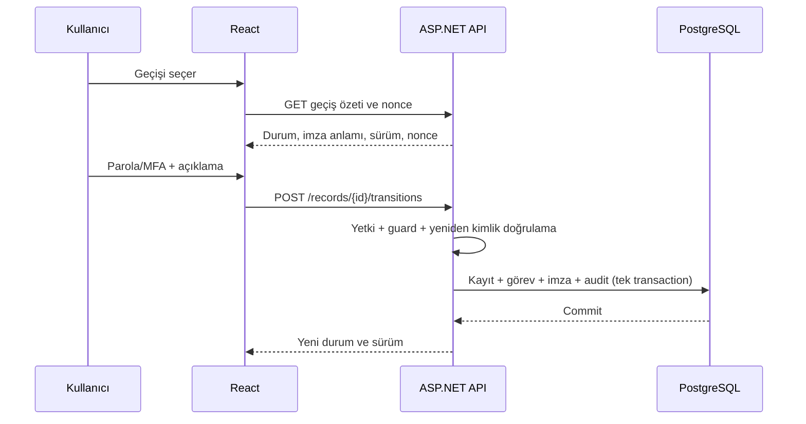

# eQMS Teknik Mimari ve Proje Planı

**Sürüm:** 1.0  
**Tarih:** 25 Ağustos 2026  
**İş analizi:** [EQMS_SISTEM_ANALIZI.md](./EQMS_SISTEM_ANALIZI.md)
**Dağıtım modeli:** Tek kurum, multi-tenant değil

## 1. Kesinleşen teknoloji yığını

| Katman | Seçim | Başlangıç sürümü |
|---|---|---|
| Backend | ASP.NET Core Web API | .NET 10 LTS / ASP.NET Core 10 |
| ORM ve migrasyon | Entity Framework Core + Npgsql | EF Core 10 uyumlu güncel patch |
| Frontend | React + TypeScript | React 19.2 |
| Derleme aracı | Vite | Vite 8, güncel desteklenen minor |
| Veritabanı | PostgreSQL | PostgreSQL 18, güncel minor |
| Konteyner | Docker + Docker Compose | Güncel desteklenen Docker Engine/Compose |
| API tanımı | REST + OpenAPI | `/api/v1` |

Sürüm gerekçesi:

- .NET 10 aktif LTS sürümüdür ve 14 Kasım 2028'e kadar desteklenir.
- React resmî dokümantasyonundaki güncel ana sürüm 19.2'dir.
- Vite 8 kararlı sürümdür; güncel desteklenen minor kullanılmalıdır.
- PostgreSQL 18, 14 Kasım 2030'a kadar desteklenmektedir.

Patch sürümleri kaynak kodda ve Docker imajlarında sabitlenmeli; güncelleme önce test/validasyon ortamında değişiklik kontrolü ve regresyon testlerinden geçirilmelidir.

## 2. Mimari karar: modüler monolit

Bu proje için başlangıç mimarisi **modüler monolit** olmalıdır.



### Neden mikroservis değil?

- Tek kurum ve tek ürün sınırı vardır.
- Sapma, DÖF, aksiyon, imza ve audit olayları çoğu zaman aynı transaction içinde tutarlı yazılmalıdır.
- Validasyon kapsamı, dağıtım ve hata analizi daha anlaşılır kalır.
- Modüller arası zincir için ağ üzerinden dağıtık transaction gerektirmez.
- Küçük ekipte geliştirme ve işletme maliyeti düşer.

Modüler sınırlar kod ve veritabanı şemalarıyla korunur. İleride yalnız gerçek ölçek veya bağımsız yaşam döngüsü ihtiyacı doğan parçalar ayrıştırılabilir.

## 3. Önerilen repository yapısı

```text
QMS/
├── Qms.sln
├── Directory.Build.props
├── Directory.Packages.props
├── backend/
│   ├── src/
│   │   ├── Qms.Api/
│   │   ├── Qms.Application/
│   │   ├── Qms.Domain/
│   │   ├── Qms.Infrastructure/
│   │   ├── Qms.Worker/
│   │   └── Qms.Contracts/
│   └── tests/
│       ├── Qms.Domain.Tests/
│       ├── Qms.Application.Tests/
│       ├── Qms.IntegrationTests/
│       └── Qms.ArchitectureTests/
├── frontend/
│   ├── src/
│   │   ├── app/
│   │   ├── modules/
│   │   ├── shared/
│   │   ├── pages/
│   │   └── test/
│   └── e2e/
├── deploy/
│   ├── docker-compose.yml
│   ├── docker-compose.dev.yml
│   ├── docker-compose.prod.yml
│   ├── api.Dockerfile
│   ├── worker.Dockerfile
│   ├── frontend.Dockerfile
│   └── nginx/
├── docs/
│   ├── adr/
│   ├── validation/
│   └── api/
├── scripts/
├── .env.example
└── README.md
```

İlk aşamada tek bir `QmsDbContext` kullanılması önerilir. Modül sınırları `IEntityTypeConfiguration`, namespace, klasör ve PostgreSQL şemalarıyla ayrılır. Bu yaklaşım, kritik kayıt + imza + audit + görev yazımlarını tek transaction içinde güvenceye alır.

## 4. Backend katmanları

### 4.1 Qms.Api

Sorumlulukları:

- HTTP endpointleri ve OpenAPI.
- Kimlik doğrulama/CSRF/CORS güvenlik sınırı.
- İstek doğrulama ve standart hata sözleşmesi.
- Kullanıcı/istek correlation bilgisi.
- Rate limiting ve sağlık kontrolleri.
- API sürümleme.

Controller veya minimal API kullanılabilir; önemli olan endpointlerin uygulama use-case'lerine ince bir adaptör olarak kalmasıdır. İş kuralı endpoint içinde yazılmamalıdır.

### 4.2 Qms.Application

Sorumlulukları:

- Use-case/command/query işleyicileri.
- Yetki ve kayıt kapsam kontrolleri.
- Workflow geçiş orkestrasyonu.
- Transaction sınırları.
- Idempotency.
- Domain event ve outbox üretimi.
- Dış sistem portları.

Örnek use-case'ler:

```text
CreateDeviation
UpdateDeviationDraft
SubmitDeviation
SignTransition
CreateCapaFromRecord
AssignAction
RequestActionCompletion
VerifyRealizedAction
CompleteEffectivenessReview
CloseQualityRecord
ExportAuditPackage
```

### 4.3 Qms.Domain

Sorumlulukları:

- Aggregate ve entity'ler.
- Değer nesneleri.
- Durum makinelerinin değişmezleri.
- Risk, termin ve kapanış kuralları.
- Domain eventleri.

Domain katmanı ASP.NET, EF Core veya e-posta gibi altyapı ayrıntılarına bağımlı olmamalıdır.

### 4.4 Qms.Infrastructure

Sorumlulukları:

- EF Core ve Npgsql.
- PostgreSQL migrasyonları.
- Dosya depolama adaptörü.
- Parola/kimlik, e-posta ve entegrasyon adaptörleri.
- Outbox ve audit kalıcılığı.
- PDF/Excel dışa aktarım altyapısı.
- Gözlemlenebilirlik.

### 4.5 Qms.Worker

API'den ayrı konteynerde aynı kod tabanını kullanır:

- Hatırlatma ve eskalasyon.
- Outbox mesajlarının güvenilir işlenmesi.
- E-posta gönderimi ve tekrar denemeleri.
- Planlı periyodik değerlendirmeler.
- Büyük dışa aktarımlar.
- Dosya tarama/işleme.
- Arama projeksiyonları ve entegrasyonlar.

Worker işlemleri idempotent olmalı; aynı mesaj ikinci kez işlense mükerrer DÖF, bildirim veya görev üretmemelidir.

## 5. Backend modül sınırları

Kod içinde aşağıdaki üst düzey modüller önerilir:

```text
Modules/
├── Identity/
├── Organization/
├── QualityRecords/
├── Workflow/
├── ElectronicSignatures/
├── AuditTrail/
├── Documents/
├── Training/
├── Deviations/
├── Capa/
├── ChangeControl/
├── Audits/
├── Complaints/
├── RiskManagement/
├── OutOfSpecification/
├── Pharmacovigilance/
├── Suppliers/
├── Artwork/
├── Mbr/
├── Actions/
└── Reporting/
```

Her modülde mümkün olduğunca aynı iç düzen kullanılmalıdır:

```text
Deviations/
├── Domain/
├── Application/
├── Infrastructure/
└── Api/
```

Modüller birbirinin EF entity'lerine doğrudan müdahale etmemeli. Zincir ilişkileri `QualityRecords` çekirdeği ve uygulama servisleri üzerinden kurulmalıdır.

## 6. PostgreSQL veri stratejisi

### 6.1 Şemalar

Tek veritabanı içinde mantıksal şemalar:

```text
identity
organization
core
workflow
audit
document
training
deviation
capa
change_control
inspection
complaint
risk
laboratory
pv
supplier
reporting
integration
```

`tenant_id` bulunmaz. Tek kurum bilgisi `organization.organization_settings` tablosunda tekil kayıt olarak tutulur. Tesis ve bölüm ayrımı tenant değil, iş bağlamıdır.

### 6.2 İlişkisel + JSONB hibrit model

İlişkisel kolonlarda tutulacak alanlar:

- Kayıt kimliği, numarası, modül/tür.
- Durum, sınıf ve risk seviyesi.
- Kayıt sahibi, bölüm, tesis ve mevcut görev.
- Oluşturma, hedef ve kapanış tarihleri.
- Ürün, batch, tedarikçi ve doküman bağlantıları.
- Akış/form sürümü ve optimistic concurrency sürümü.

JSONB'de tutulabilecek alanlar:

- Sürümlü dinamik formun modüle özel değişken alanları.
- Parametrik değerlendirme cevapları.
- Düşük sorgu gereksinimli ek alanlar.

Aksiyon, görev, batch etkisi, imza, audit olayı, dosya sürümü ve kayıt ilişkisi JSONB içine gömülmemeli; ayrı ilişkisel tablolarda tutulmalıdır.

### 6.3 Kimlikler ve eşzamanlılık

- Dahili anahtar: uygulama tarafından üretilen UUID v7 veya eşdeğer sıralanabilir UUID.
- Kayıt numarası: ayrı atomik sayaç tablosu/işlevi.
- Her değişebilir aggregate için `version bigint` optimistic concurrency alanı.
- Güncelleme `WHERE id = ... AND version = expectedVersion` ile yapılır.
- Çakışmada `409 Conflict` ve kullanıcıya alan farkları dönülür.

### 6.4 Denetim izi

Önerilen ana tablo:

```text
audit.audit_event
  id
  aggregate_type
  aggregate_id
  aggregate_version
  event_type
  actor_user_id
  actor_display_name_snapshot
  occurred_at_utc
  reason
  correlation_id
  source_ip / client_context (risk kararına göre)
  payload_jsonb
  previous_event_hash
  event_hash
```

Savunma katmanları:

- Uygulama rolü audit tablosunda yalnız `INSERT/SELECT` yetkisine sahip olur.
- Güncelleme ve silme veritabanı yetkisiyle engellenir.
- Alan değişiklikleri ayrı projeksiyonla kolay okunur hale getirilir.
- İsteğe bağlı hash zinciri değişiklik tespitine yardımcı olur; tek başına mevzuat uyumluluğu kanıtı değildir.
- Audit event, iş kaydı ve e-imza aynı veritabanı transaction'ında yazılır.

### 6.5 Outbox

```text
integration.outbox_message
  id
  occurred_at_utc
  type
  payload_jsonb
  status
  attempt_count
  next_attempt_at
  processed_at
  last_error
```

Transaction tamamlanınca worker e-posta, bildirim, rapor projeksiyonu ve dış entegrasyonu işler. Kullanıcı işlemi başarısız e-posta nedeniyle geri alınmaz; teslimat sonucu izlenir ve eskale edilir.

## 7. Kimlik doğrulama ve e-imza tasarımı

### 7.1 SPA oturumu

Önerilen varsayılan:

- React ve API aynı origin altında reverse proxy ile sunulur.
- Oturum `Secure`, `HttpOnly`, `SameSite` cookie ile tutulur.
- Durum değiştiren isteklerde antiforgery/CSRF tokenı kullanılır.
- Erişim tokenı `localStorage` içine yazılmaz.
- ASP.NET Core Identity yerel kullanıcılar için kullanılabilir; kurumsal SSO geldiğinde OIDC adaptörü eklenebilir.

### 7.2 Kritik imza akışı



Kurallar:

- Parola e-imza veya audit tablosuna yazılmaz.
- Nonce tek kullanımlık ve kısa ömürlüdür.
- İmza isteği kayıt sürümüne bağlıdır; arada veri değişmişse imza reddedilir.
- İmza anlamı sunucunun geçiş tanımından gelir, istemciden serbest metin kabul edilmez.
- İade/ret/iptal için açıklama sunucuda zorunlu tutulur.

## 8. REST API tasarımı

### 8.1 Kaynak örnekleri

```text
POST   /api/v1/deviations
GET    /api/v1/deviations/{id}
PATCH  /api/v1/deviations/{id}/draft
GET    /api/v1/records/{id}/available-transitions
POST   /api/v1/records/{id}/transitions
GET    /api/v1/records/{id}/tasks
POST   /api/v1/records/{id}/relations
POST   /api/v1/records/{id}/capa
GET    /api/v1/records/{id}/audit-trail
GET    /api/v1/records/{id}/signatures
POST   /api/v1/records/{id}/attachments
POST   /api/v1/actions/{id}/completion-request
POST   /api/v1/actions/{id}/verification
POST   /api/v1/exports/audit-package
```

### 8.2 Standartlar

- Problem Details (`application/problem+json`) hata sözleşmesi.
- UTC tarih/saat; cevapta ISO 8601.
- Listeleme için cursor veya kararlı sayfalama.
- Filtrelerin whitelist ile sunucu tarafında uygulanması.
- Yazma endpointlerinde `Idempotency-Key`.
- Eşzamanlılık için `ETag/If-Match` veya açık `expectedVersion`.
- Correlation ID hem cevapta hem log/audit zincirinde.
- OpenAPI tanımından TypeScript istemci tiplerinin otomatik üretimi.

## 9. React/Vite frontend mimarisi

### 9.1 Önerilen klasörleme

```text
src/
├── app/
│   ├── router/
│   ├── providers/
│   ├── auth/
│   └── layout/
├── modules/
│   ├── deviations/
│   ├── capa/
│   ├── workflow/
│   ├── audit-trail/
│   ├── documents/
│   └── ...
├── shared/
│   ├── api/
│   ├── components/
│   ├── forms/
│   ├── tables/
│   ├── hooks/
│   ├── validation/
│   └── utils/
├── pages/
└── test/
```

### 9.2 Önerilen frontend bileşenleri

- TypeScript strict mode.
- React Router: route ve yetki sınırları.
- TanStack Query: sunucu durumu, cache ve mutation yönetimi.
- React Hook Form + Zod: kullanıcı deneyimi amaçlı form doğrulama.
- Sunucu her zaman nihai doğrulama otoritesidir.
- Kurumsal UI kütüphanesi seçilmelidir; varsayılan öneri MUI tabanlı tasarım sistemi.
- i18next: Türkçe/İngilizce gereksinimi varsa.
- Sunucu OpenAPI tanımından üretilen typed API client.

Global state minimum tutulmalıdır. Kayıtlar ve görevler TanStack Query cache'inde; tema, geçici filtre ve kullanıcı arayüzü tercihleri küçük bir app store/context içinde tutulabilir.

### 9.3 Ortak ekran bileşenleri

- `RecordHeader`: kayıt no, durum, sahip, termin, sınıf.
- `WorkflowActionMenu`: sunucunun döndürdüğü kullanılabilir geçişler.
- `ElectronicSignatureDialog`.
- `RecordTabs` ve dinamik form renderer.
- `RelatedRecordsGraph/List`.
- `TaskAndActionGrid`.
- `AuditTrailViewer`: alan, eski/yeni değer, kullanıcı, tarih ve neden.
- `SignatureManifest`.
- `AttachmentVersionList`.
- `DueDateHistory`.
- `PermissionBoundary` yalnız görünüm kolaylığı sağlar; güvenlik API'de uygulanır.

## 10. Docker topolojisi

### 10.1 Geliştirme ortamı

```text
qms-postgres     PostgreSQL 18
qms-api          ASP.NET Core API
qms-worker       .NET Worker
qms-web          Vite dev server veya Nginx build
qms-mail         Yerel e-posta yakalayıcı (yalnız development)
qms-storage      Yerel volume veya isteğe bağlı S3 uyumlu depolama
```

### 10.2 Üretim ortamı

```text
internet/intranet
      |
reverse-proxy (TLS)
      |-- /       -> static React assets
      `-- /api    -> qms-api

qms-api -------- PostgreSQL
qms-worker ----- PostgreSQL
qms-api/worker - managed file storage
```

Üretim kuralları:

- Vite development server üretimde kullanılmaz; derlenen statik dosyalar Nginx veya kurumun reverse proxy'sinden sunulur.
- `latest` image tag kullanılmaz; imaj digest veya kesin sürüm sabitlenir.
- Parola ve anahtarlar compose dosyasına yazılmaz; Docker secrets veya kurum secret store kullanılır.
- PostgreSQL veri dizini ve dosya depolama kalıcı volume üzerindedir.
- Healthcheck ve readiness tanımlanır.
- API başlangıcında otomatik üretim migrasyonu çalıştırılmaz.
- Migrasyon ayrı, tek seferlik `qms-migrator` containerı ve onaylı dağıtım adımıyla yürütülür.
- Veritabanı ve dosya yedeği aynı tutarlı geri dönüş noktasına göre planlanır.

## 11. Dosya depolama

Veritabanına büyük dosya binary'si yazmak yerine soyutlanmış dosya depolama kullanılması önerilir.

```text
IFileStorage
  PutAsync
  OpenReadAsync
  ExistsAsync
  QuarantineAsync
  DeleteAfterRetentionApprovalAsync
```

Metadata PostgreSQL'de, içerik dosya depolamada bulunur:

- Dosya ve sürüm kimliği.
- Orijinal ad, MIME türü ve boyut.
- SHA-256 özeti.
- Yükleyen, yükleme zamanı ve kaynak kayıt sürümü.
- Zararlı yazılım tarama durumu.
- Depolama anahtarı; fiziksel yol kullanıcıya verilmez.
- Saklama/karantina durumu.

Development için Docker volume; üretim için kurumun onayladığı S3 uyumlu nesne depolama veya güvenli ağ dosya sistemi kullanılabilir.

## 12. Bildirim ve zamanlayıcı

Öneri: persistent PostgreSQL store kullanan bir .NET scheduler/background job altyapısı.

Görevler:

- Termine 7 gün kala hatırlatma.
- Termine 1 gün kala hatırlatma.
- Gecikmede bölüm yöneticisine eskalasyon.
- Periyodik doküman ve tedarikçi gözden geçirme.
- Eğitim süresi dolma uyarısı.
- CAPA etkinlik değerlendirme tarihinin açılması.

Zamanlayıcı yalnız bildirim üretmez. İş kuralına göre gecikmiş durumu ve eskalasyon olayını veritabanına yazar; e-posta bunun bir teslim kanalıdır.

## 13. Gözlemlenebilirlik

- Structured JSON log.
- Correlation/trace ID.
- OpenTelemetry trace ve metric üretimi.
- API, worker, PostgreSQL bağlantısı, outbox backlog ve e-posta hata metrikleri.
- Sağlık endpointleri: `/health/live`, `/health/ready`.
- Audit trail ile uygulama logu ayrıdır; log audit yerine geçmez.
- Loglara parola, token, sağlık verisi veya gereksiz form içeriği yazılmaz.

## 14. Test ve validasyon stratejisi

### 14.1 Otomatik test piramidi

- Domain birim testleri: durum ve kapanış değişmezleri.
- Application testleri: use-case, yetki, idempotency.
- PostgreSQL integration testleri: gerçek PostgreSQL containerı ile EF/migrasyon ve transaction.
- API contract testleri: Problem Details, yetki ve concurrency.
- React component testleri.
- Playwright uçtan uca testleri.
- Mimari testler: katman ve modül bağımlılıkları.
- Güvenlik testleri: yetki yükseltme, CSRF, dosya ve injection.
- Performans testleri: liste, audit trail ve toplu rapor.

SQLite/InMemory EF sağlayıcısı kritik integration testlerinde kullanılmamalıdır; PostgreSQL davranışını doğru temsil etmez.

### 14.2 Gereksinim izlenebilirliği

Her kritik gereksinimin sabit bir kodu olmalıdır:

```text
URS-WF-001  Açık aksiyon varken kayıt kapanamaz.
FRS-WF-014  Close transition guard open verified actions sayısını kontrol eder.
TEST-WF-032 Açık aksiyonlu sapmada kapanış 409/iş kuralı hatası döndürür.
```

Pull request, test sonucu ve sürüm etiketi bu zincire bağlanmalıdır. Form/akış konfigürasyonları da kod kadar kontrollü sürümlenmelidir.

## 15. CI/CD ve kontrollü dağıtım

Önerilen pipeline:

1. Restore/install kilit dosyalarıyla.
2. Backend build ve unit test.
3. Frontend type-check, lint ve test.
4. PostgreSQL integration testleri.
5. OpenAPI uyumluluk/değişiklik kontrolü.
6. Dependency ve container güvenlik taraması.
7. Tekrarlanabilir backend/frontend image build.
8. SBOM ve imaj özeti üretimi.
9. Test/validasyon ortamına dağıtım.
10. Onaylı otomatik ve manuel validasyon testleri.
11. Değişiklik kontrolü onayı.
12. Migrator + production deployment.
13. Smoke test ve rollback doğrulaması.

Üretime doğrudan geliştirici makinesinden dağıtım yapılmamalıdır.

## 16. İlk geliştirme dikeyi

İlk kodlama hedefi tüm modülleri boş kabuk olarak açmak değil, bir uçtan uca kalite zincirini çalıştırmaktır.

### Dikey 1 — Çekirdek + Sapma

- Docker Compose ve solution iskeleti.
- Identity, kurum, kullanıcı, bölüm ve rol.
- Kayıt zarfı, kayıt numarası ve optimistic concurrency.
- Sürümlü basit form tanımı.
- Sapma taslağı ve gönderme.
- Workflow task ve durum geçişi.
- E-imza yeniden doğrulama.
- Append-only audit trail.
- React kayıt listesi, form, imza ve tarihçe ekranı.

### Dikey 2 — Sapma → DÖF → Aksiyon

- İlişkili kayıt grafiği.
- Sapmadan idempotent DÖF oluşturma.
- Aksiyon atama, tamamlanma talebi ve KG doğrulaması.
- Açık aksiyon/DÖF kapanış engeli.
- Hatırlatma, eskalasyon ve ortak iş listesi.

### Dikey 3 — Etkinlik ve denetim kanıtı

- CAPA etkinlik planı/sonucu.
- Kapanış imzaları.
- PDF/denetim paketi.
- Audit trail inceleme ekranı.
- Uçtan uca validasyon senaryoları.

## 17. İlk teknik karar kayıtları

`docs/adr` altında aşağıdaki ADR'ler yazılmalıdır:

- ADR-001: Modüler monolit seçimi.
- ADR-002: Tek kurum ve `tenant_id` kullanılmaması.
- ADR-003: PostgreSQL ilişkisel + JSONB hibrit model.
- ADR-004: Cookie tabanlı SPA oturumu ve CSRF.
- ADR-005: E-imza yeniden doğrulama ve kayıt sürümüne bağlama.
- ADR-006: Append-only audit trail ve veritabanı yetkileri.
- ADR-007: Outbox + ayrı worker.
- ADR-008: Dosya içeriğinin veritabanı dışında saklanması.
- ADR-009: Üretim migrasyonlarının ayrı migrator adımıyla çalışması.

## 18. Kodlamadan önce kalan seçimler

Teknoloji omurgası bellidir. Scaffold başlamadan önce yalnız şu operasyonel seçimler gereklidir:

1. Kurulum: kurum içi sunucu mu, özel/genel bulut VM mi?
2. Kimlik: ASP.NET Core Identity mi, Active Directory/Entra/başka OIDC mi?
3. Arayüz kütüphanesi: önerilen MUI uygun mu?
4. Dosya depolama: Docker volume, kurum dosya sunucusu veya S3/MinIO mu?
5. İlk kodlanacak kapsam: önerilen Sapma + DÖF + Aksiyon zinciri onaylanıyor mu?
6. Türkçe tek dil mi, Türkçe/İngilizce mi?

## 19. Kaynaklar

- [Microsoft .NET support policy](https://dotnet.microsoft.com/en-us/platform/support/policy)
- [React versions](https://react.dev/versions)
- [Vite releases and supported versions](https://vite.dev/releases)
- [Vite 8 announcement](https://vite.dev/blog/announcing-vite8)
- [PostgreSQL versioning policy](https://www.postgresql.org/support/versioning/)

## Sonuç

Seçilen yığın eQMS için uygundur. Önerilen hedef; React SPA'nın ince bir kullanıcı arayüzü, ASP.NET Core'un tek iş kuralı otoritesi, PostgreSQL'in transaction ve denetim kanıtı deposu, Docker'ın ise tekrarlanabilir çalışma/dağıtım sınırı olduğu modüler monolittir. İlk teslimat, Sapma → DÖF → Aksiyon → Etkinlik → Kapanış zincirini e-imza ve audit trail ile uçtan uca kanıtlamalıdır.
